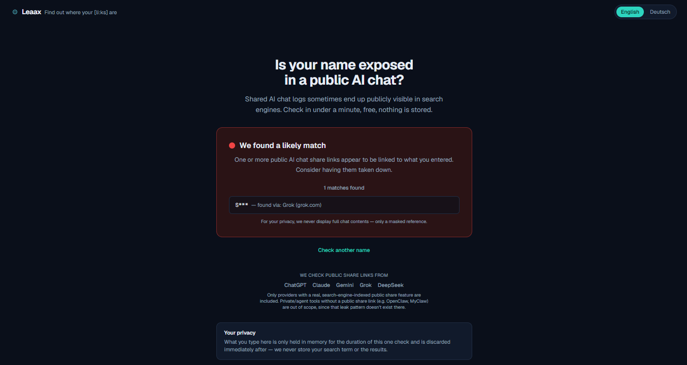
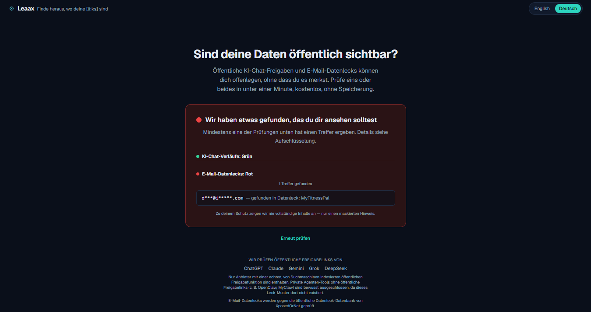

# leaax
Leaax — find out where your [li:ks] are

*English version*


*German version*


## **What's this about?**
Freelancers, small businesses, and individuals alike trust their data to cloud services and AI tools every day — usually without knowing whether that data is publicly exposed somewhere.

## **The problem**
In recent months, shared AI chat logs (ChatGPT, Claude, and others) have repeatedly turned up in plain Google searches — thousands of private conversations, including personal messages, customer data, internal strategy, and even credentials. Most existing security tools are built for developers and large IT departments. For everyone else who just wants to know "am I affected?", nothing has really fit — until now.

## **What Leaax does**
A free check in under 60 seconds: is your name linked to publicly exposed AI chat logs or openly shared cloud folders? Results come as a clear traffic-light score — red, yellow, green — in plain language, no jargon. Your checked data is never stored. Want ongoing peace of mind? Keep monitoring running as a subscription.

## **Status**
🚧 Building in public.

## MVP 1 — scope

MVP 1 ships exactly one core flow, live and usable: enter a name or
company → the app checks for publicly indexed AI chat share links tied to
it → result comes back as a traffic light (red/yellow/green).

Explicitly **not** part of MVP 1: cloud-share-link checks, user accounts,
paid subscriptions/ongoing monitoring. Those come later.

Checked providers (public, search-engine-indexed share links only —
see [`src/lib/providers.ts`](src/lib/providers.ts) to extend):
ChatGPT, Claude, Gemini, Grok, DeepSeek.

## Getting started

Requirements: Node.js 20+ and npm.

```bash
npm install
cp .env.example .env.local
```

Then fill in `BRAVE_SEARCH_API_KEY` in `.env.local` (get a free key at the
[Brave Search API dashboard](https://api-dashboard.search.brave.com/)).
Without it, `/api/check` responds with a clear "not configured" error
instead of crashing — the UI still runs for local development.

```bash
npm run dev
```

Open [http://localhost:3000](http://localhost:3000).

## Security & privacy notes (MVP 1)

- The search query and results are never persisted (no DB, no file, no
  analytics call) — they live only in the memory of the request that
  handles them. See [`src/app/api/check/route.ts`](src/app/api/check/route.ts).
- Server logs never contain the search term, see [`src/lib/logger.ts`](src/lib/logger.ts).
- Input is sanitized/validated server-side, see [`src/lib/validate.ts`](src/lib/validate.ts).
- Requests are rate-limited per IP, see [`src/lib/rateLimit.ts`](src/lib/rateLimit.ts)
  (in-memory per serverless instance — good enough for MVP-1's "no backend"
  constraint; swap for a shared store like Upstash Redis if abuse becomes an issue).
- Security headers (CSP, HSTS, etc.) are set in [`next.config.ts`](next.config.ts).
- Full chat contents are never shown — only a masked label and the source
  domain, see [`src/lib/mask.ts`](src/lib/mask.ts).

## Deployment

The app is a standard Next.js app, deployable on Vercel's free tier:

1. Push this repo to GitHub (already done — `LeaaxHQ/leaax`).
2. Import the repo in the [Vercel dashboard](https://vercel.com/new).
3. Add the `BRAVE_SEARCH_API_KEY` environment variable in the Vercel
   project settings.
4. Deploy, then attach the `leaax.com` domain under Project → Settings →
   Domains, and point its DNS at Vercel per their instructions.
